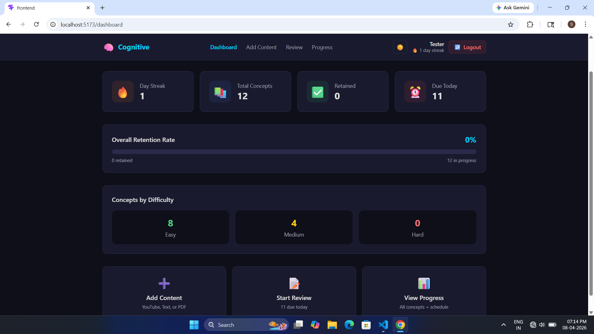
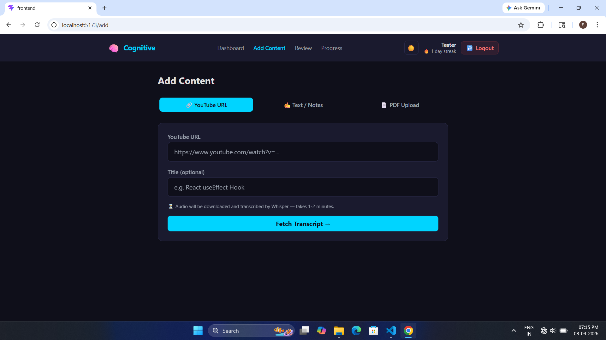
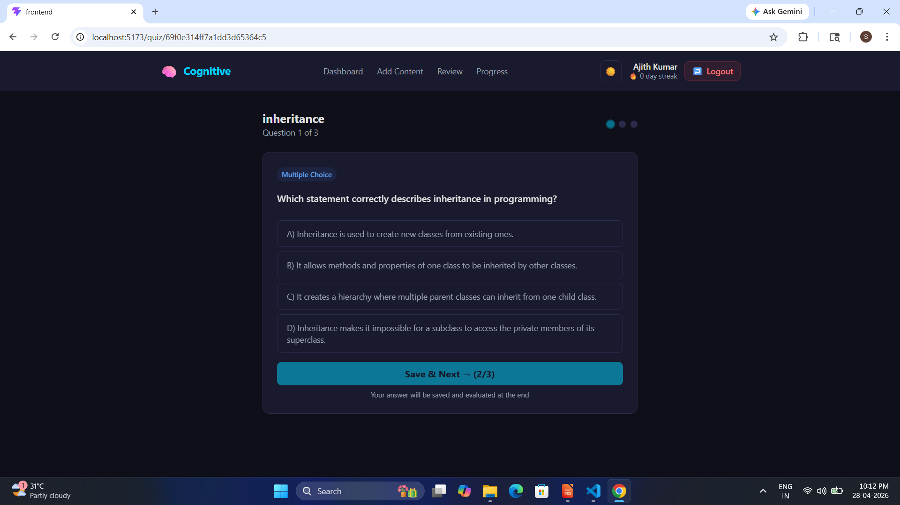
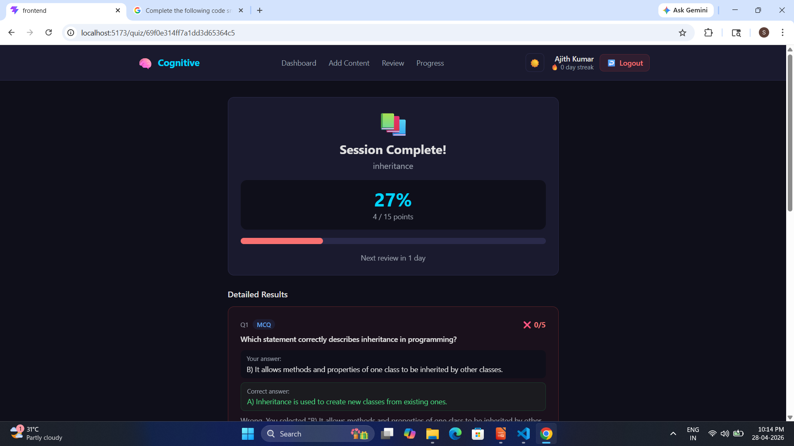
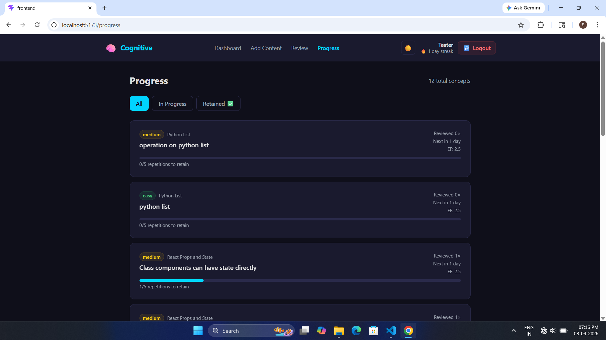

# 🧠 LLM-Powered Knowledge Reinforcement System

An AI-powered full-stack web application that helps programming 
students retain technical knowledge using Spaced Repetition and 
a locally hosted Large Language Model.

## 🎯 Problem It Solves
Students forget up to 90% of tutorial content within one week.
This system automates knowledge reinforcement by extracting concepts,
generating quiz questions, and scheduling reviews using the SM-2 algorithm.

## ✨ Features
- 📺 YouTube video transcription using yt-dlp + OpenAI Whisper
- 📄 PDF upload with automatic text extraction
- ✍️ Manual text note submission
- 🧠 AI concept extraction using Qwen 2.5:3b (local LLM via Ollama)
- ❓ Auto-generated MCQ, fill-blank, and coding quiz questions
- 🔄 SM-2 Spaced Repetition algorithm (14-day retention cycle)
- 📊 Progress dashboard with retention rate and streak tracking
- 🌙 Dark and Light theme support

## 🛠️ Tech Stack

### Backend
- Node.js + Express.js
- MongoDB + Mongoose
- Python + yt-dlp + OpenAI Whisper
- Qwen 2.5:3b via Ollama (Local LLM)
- JWT Authentication + bcryptjs
- Nodemailer + node-cron

### Frontend
- React.js 18 + Vite
- Tailwind CSS v3
- React Router v6
- Axios

## 📁 Project Structure
llm-knowledge-reinforcement-system/
├── backend/
│   ├── config/
│   ├── controllers/
│   ├── middleware/
│   ├── models/
│   ├── routes/
│   ├── services/
│   ├── utils/
│   └── server.js
└── frontend/
├── src/
│   ├── api/
│   ├── components/
│   ├── context/
│   └── pages/
└── index.html

## ⚙️ Setup Instructions

### Prerequisites
- Node.js v18+
- Python 3.10+
- MongoDB Atlas account
- Ollama installed → https://ollama.com

### 1. Clone the repository
```bash
git clone https://github.com/YourUsername/llm-knowledge-reinforcement-system.git
cd llm-knowledge-reinforcement-system
```

### 2. Setup Backend
```bash
cd backend
npm install
cp .env.example .env
# Fill in your values in .env
```

### 3. Setup Ollama + Qwen
```bash
# Install Ollama from https://ollama.com
ollama pull qwen2.5:3b
ollama serve
```

### 4. Setup Python dependencies
```bash
pip install yt-dlp openai-whisper
```

### 5. Start Backend
```bash
npm run dev
```

### 6. Setup Frontend
```bash
cd ../frontend
npm install
npm run dev
```

Open http://localhost:5173

## 🔑 Environment Variables
Copy `backend/.env.example` to `backend/.env` and fill in:
- `MONGO_URI` — MongoDB Atlas connection string
- `JWT_SECRET` — Any long random string
- `QWEN_BASE_URL` — http://localhost:11434
- `QWEN_MODEL` — qwen2.5:3b

## 📸 Screenshots
### Dashboard


### Add Content


### Quiz Page


### Results


### Progress


## 👨‍💻 Author
**SANJAY S** — Final Year MCA Project  
Madurai Kamaraj University


